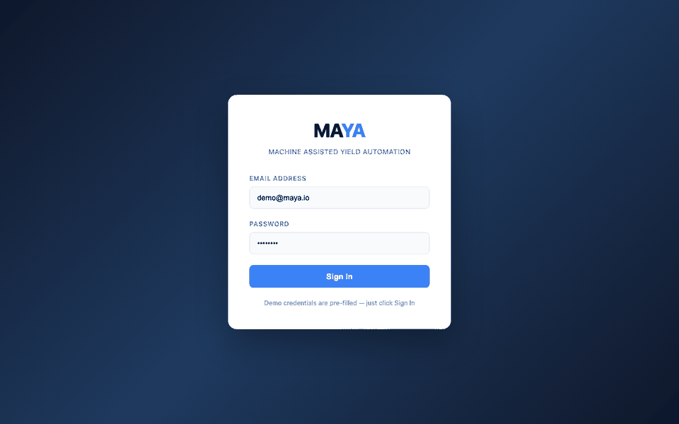
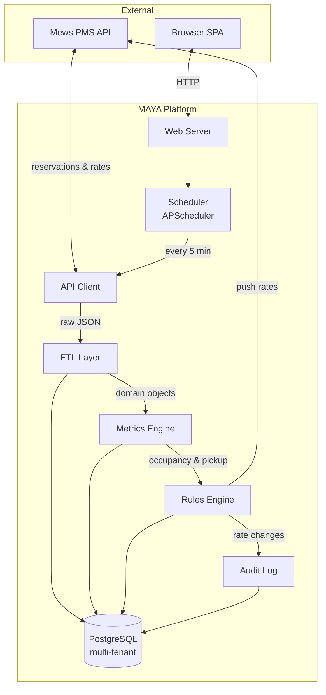
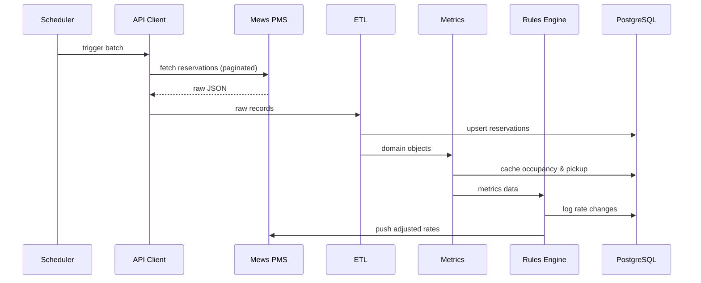
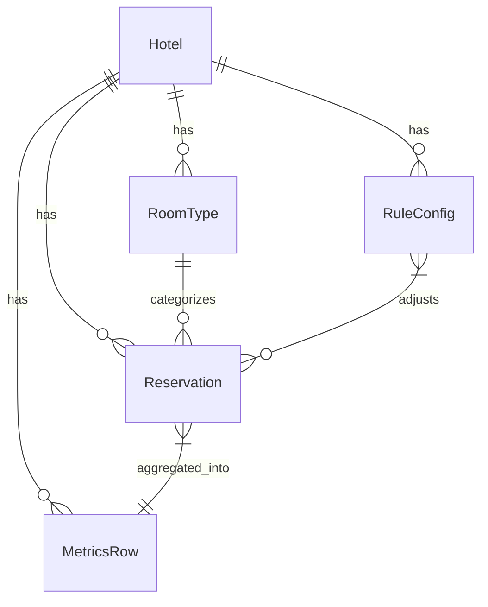

<p align="center">
  
  
  
  
  
</p>

<h1 align="center">
  <br>
  MAYA
  <br>
  <sub>Machine Assisted Yield Automation</sub>
</h1>

<p align="center">
  <strong>An intelligent, multi-hotel revenue management system that automates dynamic pricing<br>through real-time occupancy monitoring, rule-based rate optimization, and seamless PMS integration.</strong>
</p>

<p align="center">
  
</p>

<br>

<!-- ━━━ TABLE OF CONTENTS ━━━━━━━━━━━━━━━━━━━━━━━━━━━━━━━━━━━━━━━━━━━━━━━━━ -->

<details>
<summary><strong>Table of Contents</strong></summary>

- [Overview](#overview)
- [Architecture](#architecture)
- [Quick Start](#quick-start)
- [Project Structure](#project-structure)
- [Module Reference](#module-reference)
  - [config.py — Configuration](#configpy--configuration)
  - [models.py — Data Models](#modelspy--data-models)
  - [rules_engine.py — Dynamic Pricing](#rules_enginepy--dynamic-pricing)
  - [api_client.py — Mews Integration](#api_clientpy--mews-integration)
  - [db.py — Database Layer](#dbpy--database-layer)
  - [tools/local_gui.py — Interactive Dashboard](#toolslocal_guipy--interactive-dashboard)
- [Dashboard Preview](#dashboard-preview)
- [Running Tests](#running-tests)
- [Configuration](#configuration)
- [Environment Variables](#environment-variables)
- [Tech Stack](#tech-stack)
- [Contributing](#contributing)

</details>

<br>

<!-- ━━━ OVERVIEW ━━━━━━━━━━━━━━━━━━━━━━━━━━━━━━━━━━━━━━━━━━━━━━━━━━━━━━━━━━ -->

## Overview

MAYA connects to your Property Management System (currently [Mews](https://www.mews.com/)), continuously monitors reservation data, and automatically adjusts room rates based on configurable pricing rules. It's designed for hotel groups managing multiple properties from a single platform.

### Key Capabilities

| Feature | Description |
|:--------|:------------|
| **Multi-Hotel Management** | Manage unlimited properties from one dashboard with per-hotel rule isolation |
| **Dynamic Pricing Engine** | JSON-based rules engine with multi-condition logic and stacked rule evaluation |
| **Real-Time Occupancy Tracking** | Per-room-type occupancy monitoring with demand-based rate calculations |
| **Automated Rate Push-Back** | Adjusted rates are pushed directly back to the PMS via API |
| **Audit Trail** | Every rate change is logged with before/after values for compliance |
| **Interactive Dashboard** | Browser-based SPA with calendar heat-maps, rule management, and rate simulation |
| **Change Log** | Batch cycle history with toggleable view of all cycles vs. changes only |
| **Scheduled Batch Processing** | APScheduler runs the full pipeline every 5 minutes (configurable) |

<p align="right"><a href="#overview">↑ back to top</a></p>

<!-- ━━━ ARCHITECTURE ━━━━━━━━━━━━━━━━━━━━━━━━━━━━━━━━━━━━━━━━━━━━━━━━━━━━━━ -->

## Architecture



### Data Pipeline



<p align="right"><a href="#overview">↑ back to top</a></p>

<!-- ━━━ QUICK START ━━━━━━━━━━━━━━━━━━━━━━━━━━━━━━━━━━━━━━━━━━━━━━━━━━━━━━━ -->

## Quick Start

### Prerequisites

- **Python 3.9+**
- **PostgreSQL 13+** (running locally or remotely)

### 1. Clone & Install

```bash
git clone https://github.com/moonman312/MAYA.git
cd MAYA
python3 -m venv .venv
source .venv/bin/activate
pip install -r requirements.txt
```

### 2. Configure the Database

```bash
createdb maya
```

<details>
<summary>Default connection settings</summary>

```
dbname=maya user=postgres password=postgres host=localhost port=5432
```

Modify `config.py` if your setup differs.

</details>

### 3. Launch the Dashboard (Demo Mode)

```bash
python3 -m tools.local_gui
```

> Opens a browser-based dashboard with **demo data** — no PMS credentials needed.
> Perfect for exploring the UI, testing rules, and understanding the system.

### 4. Run the Full Pipeline (Production Mode)

```bash
python3 main.py
```

This will:

1. Create the database schema
2. Seed a demo hotel (if empty)
3. Fetch reservations from the Mews API
4. Run the ETL → metrics → rules pipeline
5. Start the APScheduler for recurring batch processing

<p align="right"><a href="#overview">↑ back to top</a></p>

<!-- ━━━ PROJECT STRUCTURE ━━━━━━━━━━━━━━━━━━━━━━━━━━━━━━━━━━━━━━━━━━━━━━━━━ -->

## Project Structure

```
MAYA/
│
├── config.py               # Centralized configuration constants
├── models.py               # Dataclass definitions (Hotel, Reservation, RuleConfig, …)
├── db.py                   # PostgreSQL schema & CRUD operations
├── api_client.py           # Mews Connector API client with pagination
├── etl.py                  # Raw API JSON → domain dataclass transforms
├── metrics.py              # Occupancy & pickup-rate computation
├── rules_engine.py         # JSON-based dynamic pricing rules
├── scheduler.py            # APScheduler batch orchestration
├── utils.py                # Shared utilities (date parsing, field detection)
├── main.py                 # Production entry point
├── requirements.txt        # Python dependencies
├── pytest.ini              # Test configuration
│
├── tools/
│   └── local_gui.py        # Browser-based SPA dashboard (zero dependencies)
│
├── rms_engine/
│   ├── __init__.py
│   └── config_loader.py    # File-based hotel configuration loader
│
└── tests/                  # 49 tests across 8 files
    ├── conftest.py
    ├── test_api_client.py
    ├── test_config_loader.py
    ├── test_db_scheduler.py
    ├── test_etl.py
    ├── test_local_gui.py
    ├── test_metrics.py
    ├── test_rules_engine.py
    └── test_utils.py
```

<p align="right"><a href="#overview">↑ back to top</a></p>

<!-- ━━━ MODULE REFERENCE ━━━━━━━━━━━━━━━━━━━━━━━━━━━━━━━━━━━━━━━━━━━━━━━━━━ -->

## Module Reference

### `config.py` — Configuration

All tuneable constants live here.

| Constant | Default | Description |
|:---------|:--------|:------------|
| `DB_DSN` | `dbname=maya …` | PostgreSQL connection string |
| `MEWS_BASE_URL` | `https://api.mews.com/…` | Mews API base URL |
| `BATCH_INTERVAL_MINUTES` | `5` | How often the scheduler runs |
| `DEFAULT_TOTAL_ROOMS_PER_TYPE` | `100` | Fallback room count per type |
| `FETCH_START_UTC` | `2020-01-01T00:00:00Z` | Reservation fetch window start |
| `FETCH_END_UTC` | `2030-12-31T23:59:59Z` | Reservation fetch window end |

---

### `models.py` — Data Models

All models are Python dataclasses with full type hints:

| Model | Purpose |
|:------|:--------|
| `Hotel` | Tenant configuration (API tokens, enterprise ID) |
| `RoomType` | Room category metadata |
| `Reservation` | Parsed reservation with computed fields |
| `MetricsRow` | Per-room-type per-date occupancy & pickup |
| `RuleConfig` | JSON-based pricing rule definition |
| `FieldMap` | Auto-detected API field names |

<details>
<summary><strong>Model relationships</strong></summary>



</details>

---

### `rules_engine.py` — Dynamic Pricing

Rules use a simple, powerful JSON format:

```json
{
  "rule_name": "High Occupancy Surge",
  "conditions": {
    "occupancy_percentage": ">80"
  },
  "action": {
    "adjust_rate_percent": 10
  },
  "room_types": [],
  "enabled": true
}
```

<details>
<summary><strong>Conditions reference</strong></summary>

Conditions support `>`, `<`, and `=` operators against numeric fields:

| Field | Description |
|:------|:------------|
| `occupancy_percentage` | Current occupancy as a percentage (0–100) |
| `booking_window` | Days between booking and stay date |
| `pickup_rate` | Net new reservations since last batch |

</details>

<details>
<summary><strong>Actions reference</strong></summary>

| Action | Example | Effect |
|:-------|:--------|:-------|
| `adjust_rate_percent` | `10` | +10% to current rate |
| `adjust_rate_dollars` | `50` | +$50 flat adjustment |

</details>

<details>
<summary><strong>How rule stacking works</strong></summary>

Rules are evaluated sequentially and **stack** — multiple rules can fire on the same reservation, each modifying the rate from the previous result.

```
Original rate: $200
  Rule 1 (Occ >80%, +10%) → $220
  Rule 2 (Window <3d, +$25) → $245
Final rate: $245
```

An empty `room_types` list means "apply to all."

</details>

---

### `api_client.py` — Mews Integration

The `MewsApiClient` handles:

- **Cursor-based pagination** — automatically fetches all pages for large hotels
- **Rate push-back** — `push_rate_update()` sends adjusted rates back to Mews via `rates/addRate`
- **Configurable endpoints** — base URL is per-hotel for staging/production flexibility

---

### `db.py` — Database Layer

PostgreSQL schema with full multi-tenant isolation:

| Table | Purpose |
|:------|:--------|
| `hotels` | Tenant registry |
| `room_types` | Room categories per hotel |
| `reservations` | Parsed reservation data |
| `metrics` | Cached occupancy & pickup rates |
| `rules` | Pricing rule definitions (JSONB) |
| `audit_log` | Rate change history |

> All queries are scoped by `hotel_id`. The schema is auto-created on first run via `create_schema()`.

---

### `tools/local_gui.py` — Interactive Dashboard

A fully self-contained browser-based SPA built with **zero external dependencies** — just Python's `http.server` + vanilla HTML/CSS/JS.

| Page | Description |
|:-----|:------------|
| **Login Screen** | Hotel group authentication gate |
| **Property Selector** | Switch between properties in the sidebar |
| **Occupancy Calendar** | Monthly heat-map with color-coded occupancy |
| **Day Detail View** | Per-room-type breakdown with rates and revenue |
| **Rules Manager** | Full CRUD with multi-condition builder |
| **Rate Simulator** | Preview how enabled rules affect sample reservations |
| **Change Log** | Batch cycle history with all/changes-only toggle |

<p align="right"><a href="#overview">↑ back to top</a></p>

<!-- ━━━ DASHBOARD PREVIEW ━━━━━━━━━━━━━━━━━━━━━━━━━━━━━━━━━━━━━━━━━━━━━━━━━ -->

## Dashboard Preview

### Calendar View

The occupancy calendar uses an intuitive color scheme:

| Color | Occupancy | Signal |
|:------|:----------|:-------|
| 🟢 **Green** | > 80% | Revenue is strong |
| 🟡 **Amber** | 60–80% | Monitor closely |
| 🔴 **Red** | < 60% | Action needed |

> Click any day to see a detailed breakdown by room type, including occupancy, nightly rate, and projected revenue.

### Rate Simulator

Test your pricing rules against sample reservations before enabling them. The simulator shows the original rate, new rate, percentage change, and which rules were applied.

### Change Log

View the full history of batch processing cycles. Toggle between **All Cycles** (including no-change runs) and **Changes Only** to focus on cycles where rate adjustments fired.

<p align="right"><a href="#overview">↑ back to top</a></p>

<!-- ━━━ RUNNING TESTS ━━━━━━━━━━━━━━━━━━━━━━━━━━━━━━━━━━━━━━━━━━━━━━━━━━━━━ -->

## Running Tests

```bash
# Run all tests
python -m pytest tests/ -v

# Run a specific test file
python -m pytest tests/test_rules_engine.py -v

# Run with coverage (requires pytest-cov)
python -m pytest tests/ --cov=. --cov-report=term-missing
```

> **49 tests** across 8 test files — all passing.

<p align="right"><a href="#overview">↑ back to top</a></p>

<!-- ━━━ CONFIGURATION ━━━━━━━━━━━━━━━━━━━━━━━━━━━━━━━━━━━━━━━━━━━━━━━━━━━━━ -->

## Configuration

### Hotel Setup (Database)

Hotels are stored in the `hotels` table. Each hotel requires:

| Field | Description |
|:------|:------------|
| `name` | Display name |
| `client_token` | Mews Client Token |
| `access_token` | Mews Access Token |
| `enterprise_id` | Mews Enterprise ID |
| `base_url` | API base URL (default: Mews production) |
| `total_rooms_per_type` | Room count used for occupancy % calculation |

<details>
<summary><strong>Hotel Setup (File-Based alternative)</strong></summary>

Place JSON config files in a `configs/` directory:

```json
{
  "hotel_id": 1,
  "name": "My Hotel",
  "client_token": "...",
  "access_token": "...",
  "enterprise_id": "..."
}
```

The `config_loader` module scans this directory and refreshes the cache every batch cycle.

</details>

<p align="right"><a href="#overview">↑ back to top</a></p>

<!-- ━━━ ENVIRONMENT VARIABLES ━━━━━━━━━━━━━━━━━━━━━━━━━━━━━━━━━━━━━━━━━━━━━ -->

## Environment Variables

| Variable | Maps To | Description |
|:---------|:--------|:------------|
| `MAYA_DB_DSN` | `DB_DSN` | PostgreSQL connection string |
| `MAYA_MEWS_BASE_URL` | `MEWS_BASE_URL` | Mews API base URL |
| `MAYA_BATCH_INTERVAL` | `BATCH_INTERVAL_MINUTES` | Scheduler interval in minutes |
| `MAYA_NO_BROWSER` | — | Set to `1` to suppress auto-open on launch |

<p align="right"><a href="#overview">↑ back to top</a></p>

<!-- ━━━ TECH STACK ━━━━━━━━━━━━━━━━━━━━━━━━━━━━━━━━━━━━━━━━━━━━━━━━━━━━━━━━ -->

## Tech Stack

<p align="center">
  
  
  
  
  
  
</p>

| Component | Technology | Notes |
|:----------|:-----------|:------|
| Language | Python 3.9+ | Type-hinted dataclass architecture |
| Database | PostgreSQL (psycopg2) | Multi-tenant with hotel_id scoping |
| Scheduler | APScheduler | Configurable batch intervals |
| PMS | Mews Connector API v1 | Cursor-based pagination |
| HTTP | Requests | Outbound API calls |
| Dashboard | Vanilla HTML/CSS/JS | Zero frameworks, zero build step |
| Testing | pytest | 49 tests, 8 files |

<p align="right"><a href="#overview">↑ back to top</a></p>

<!-- ━━━ CONTRIBUTING ━━━━━━━━━━━━━━━━━━━━━━━━━━━━━━━━━━━━━━━━━━━━━━━━━━━━━━ -->

## Contributing

See [CONTRIBUTING.md](CONTRIBUTING.md) for development setup and guidelines.

---

<p align="center">
  <sub>Built with precision for the hospitality industry.</sub>
</p>
